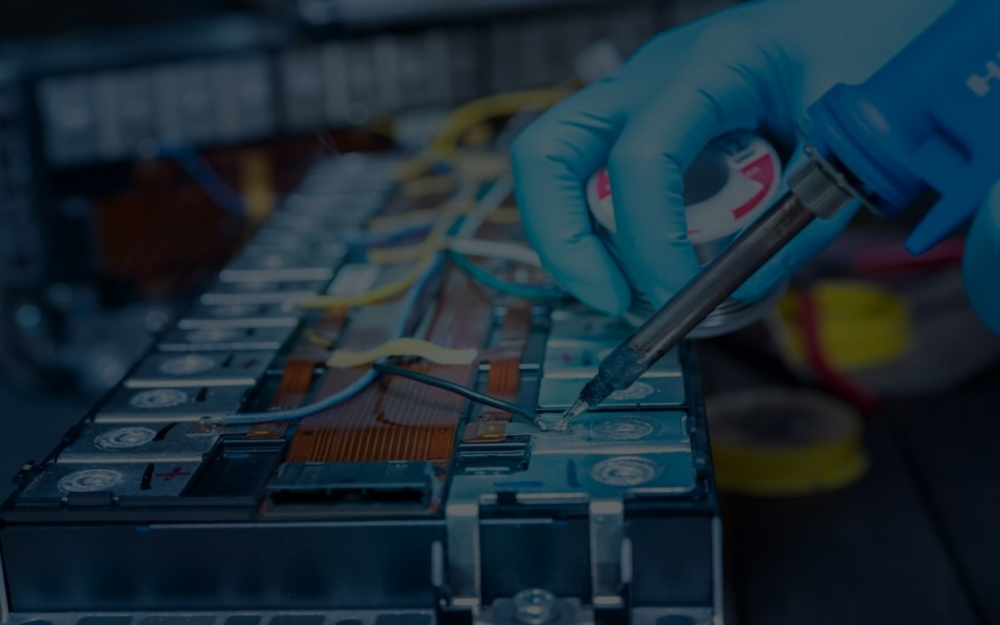

# Humaya Power - Revolutionizing Energy Solutions 🔋



## Overview

Humaya Power is at the forefront of energy transformation, specializing in high-performance lithium-ion batteries and flexible energy solutions. Our mission is to create a sustainable and greener future through innovative energy technologies.

## ✨ Features

- **Advanced Battery Technology**: State-of-the-art lithium-ion batteries
- **Interactive UI**: Modern, responsive design built with Next.js and Framer Motion
- **Seamless Experience**: Smooth animations and transitions
- **Mobile-First Approach**: Fully responsive across all devices
- **Performance Optimized**: Built with modern web technologies for optimal performance

## 🛠️ Tech Stack

- **Frontend Framework**: Next.js 14
- **Styling**: Tailwind CSS
- **Animations**: Framer Motion
- **3D Rendering**: Three.js with React Three Fiber
- **Typography**: Custom fonts with Montserrat and Syne
- **Icons**: React Icons
- **Type Safety**: TypeScript
  [](https://nextjs.org/)
  [](https://reactjs.org/)
  [](https://www.typescriptlang.org/)

<!-- <div align="center">
  
  <h1>Humaya Power</h1>
  <p>A cutting-edge web application built with Next.js</p>
  
  [](https://nextjs.org/)
  [](https://reactjs.org/)
  [](https://www.typescriptlang.org/)
</div> -->

## 🚀 Getting Started

### Prerequisites

- Node.js (version 18 or higher)
- npm or yarn package manager

### Installation

1. Clone the repository:
   ```bash
   git clone [your-repository-url]
   cd hmp-try1
   ```

2. Install dependencies:
   ```bash
   npm install
   # or
   yarn install
   ```

3. Run the development server:
   ```bash
   npm run dev
   # or
   yarn dev
   ```

4. Open [http://localhost:3000](http://localhost:3000) in your browser to see the application.

## 🌟 Usage

The application features a modern, intuitive interface with:
- Interactive landing page with parallax effects
- Smooth scroll animations
- Responsive design for all screen sizes
- Easy navigation through different sections

## 🔧 Development

### Available Scripts

- `npm run dev` - Start development server
- `npm run build` - Build for production
- `npm run start` - Start production server
- `npm run lint` - Run ESLint for code quality

### Project Structure

```
hmp-try1/
├── src/
│   ├── app/          # Next.js pages and routing
│   ├── components/   # Reusable UI components
│   └── styles/       # Global styles and Tailwind config
├── public/           # Static assets
└── ...config files
```

## 🤝 Contributing

We welcome contributions! Please feel free to submit a Pull Request.

## 📝 License

This project is licensed under the MIT License - see the LICENSE file for details.

## 🌐 Links

- [Website](https://humayapower.in/)
- [Documentation](https://your-docs.com)
- [Support](mailto:info@humayapower.com)

---

Built with ❤️ by Humaya Power Team
